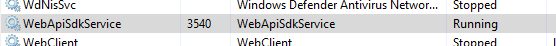

# FAQ

Please review this page carefully before contacting our support team. 

**Please note: If you haven't found a solution and need technical support, describe the issue as detailed as possible, including the steps you took to solve or reproduce it. Also please provide the log file, which can be found in the Web API installation directory. This will help us to find and fix the issue. Thank you!**

## Where can I download the latest Web API version?

Please use the Regula [Download Manager](https://support.regulaforensics.com/hc/en-us/articles/115004219343-Regula-Downloads-Manager) tool.

## Error 404 on trying to access the Web API

1. Check that WebApiSdkService is up and running   
2. Check the base address in the WebApiServiceHost.exe.config file located in the Web API installation directory; by default it is `<add key="ServiceAddress" value="`[`http://localhost`](http://localhost:1188)`"/>`
3. Make sure that there are no other programs or services listening to the same port
4. Make sure that you submit requests with the correct URL
5. If you are trying to access a built-in client or online documentation, please check that appropriate features are enabled in the WebApiServiceHost.exe.config file and restart the service

   ```text
   <add key="UseOnlineDocumentation" value="true"/>
   <add key="UseBuiltinClient" value="true"/>
   ```

## WebApiSdk service is not starting

Make sure that there are no other programs or services already occupying the configured port. Try to change the port in the WebApiServiceHost.exe.config file and start the service again.

## What is the username / password for accessing the development server at https://api.regulaforensics.com?

The username / password combination for accessing the server is **TestUser / Regul@SdkTest.**

## Why is the Authenticate section missing in case of local installation?

Authentication is not required on client installations, as in most cases it makes the integration into existing systems harder. You can ignore the authentication request and perform other requests without specifying `X-Token`

## How to change the service base address

It can be done in the WebApiServiceHost.exe.config file located in the Web API installation directory:`<add key="ServiceAddress" value="`[`http://localhost`](http://localhost:1188)`"/>`

## How to run service using HTTPS?

1. change the service base address appropriately `<add key="ServiceAddress" value="`[`https://localhost`](http://localhost:1188)`:443"/>`
2. Make sure, that no process or application is using the selected port
3. Assign a valid certificate to the port using command 

```text
netsh http add sslcert ipport=0.0.0.0:443 
certhash={your certificate Thubmprint} 
appid={your application ID} 
```

4. Restart the service to apply the changes

## READERDEMO.exe is consuming much less memory than ~400mb

It means that Regula SDK is not initialized correctly. It usually happens because the license is invalid. Please run the Regula Licensing application and send us a screenshot of its main window.

## Documents are not recognized or recognized incorrectly

1. Check that you have the latest versions of SDK and document database installed
2. Check that you have the correct type of document database installed \(WorldDocs or AllDocs\)
3. Make sure that you have specified the Document Type recognition in the Capabilities, when submitting the transaction
4. Make sure that the document image meets our [quality requirements](https://docs.regulaforensics.com/home/faq/image-quality-requirements)
5. Please send the incorrectly recognized document sample to our support team

## How to recognize multi-page documents

```text
[ 
    {   "Base64ImageString": "base64 string", 
        "Format": ".jpg", 
        "LightIndex": 6, 
        "PageIndex": 0 
    },
    {   "Base64ImageString": "base64 string", 
        "Format": ".jpg", 
        "LightIndex": 6, 
        "PageIndex": 1
     } 
 ] 
```

You should submit both document pages within a single transaction as in the example below. Please mark every separate page image with a different page index value. The transaction will be processed as usual. When the results are ready, the XML or JSON structure will contain a list with the results in accordance to the requested result type \(for each page\).

## Error 413 "Request Entity Too Large". How to configure the maximum allowed image size

The error occurs when your request \(body + headers\) exceeds the maximum allowed request length. By default, the limit value is set to 5MB. You can change this setting in the WebApiServiceHost.exe.config file:

```text
<add key="MaxRequestSizeKB" value="5120"/>
```

## Where can I find logs?

Log file\(s\) is located in the Web API installation directory. By default it is `C:\Program Files (x86)\Regula\Document Reader Web API\API`

## Is there a sample client available?

Yes. You can enable / disable it by setting the following property value:

```text
<add key="UseBuiltinClient" value="true"/>
```

## Why do I get null or "Result of this type is not available" response?

1. Check if the READERDEMO.exe process is fully initialized \(consuming ~400mb of memory\)
2. Make sure that you have specified the appropriate capabilities value to receive this kind of result when submitting the transaction
3. Make sure that image meets our [quality requirements](https://app.gitbook.com/@regulaforensics/s/home/faq/image-quality-requirements)
4. Check if the document you submitted actually contains the requested result type

## Error "Processing timeout". How to increase the maximum document processing time

The error occurs when the SDK exceeds the allowed time limit for a single transaction. To prevent transaction queue jamming, the transaction will be dropped and marked with an error status. The queue will proceed.

To extend the maximum transaction processing time, change the following property in the WebApiServiceHost.exe.config file:

```text
<add key="SdkMaxProcessingTime" value="10"/>
```

## What capabilities value do you use on api.regulaforensics.com?

The default capabilities value used on the demo website api.regulaforensics.com is **500.** It includes MRZ, Visual Zone OCR, Document Type, Visual Graphics and Barcode Processing.

## What is the lifespan of a transaction?

A transaction is discarded from the Web API service memory in **1 minute** after processing is finished.  After this period you will not be able to retrieve the results.

## Minimal requirements for Web API. How does the CPU count / memory amount affect the processing speed?

**Minimal requirements**: 

CPU - Intel i5 2.0+ GHz 

RAM - 8+ Gb 

HDD free space - 10 Gb 

OS - Windows Windows Server 2008 R2+

A single request can use more than one core which, in its turn, can increase the speed of image processing. However, it will not change the fact that the SDK will perform processing of transactions in queue mode, not concurrently.

If you need to increase the processing speed, you can run multiple VMs. You are free to use as many servers \(VMs\) as needed to guarantee the proper performance of the system. But in this case, every single server \(VM\) would require a new license key.

