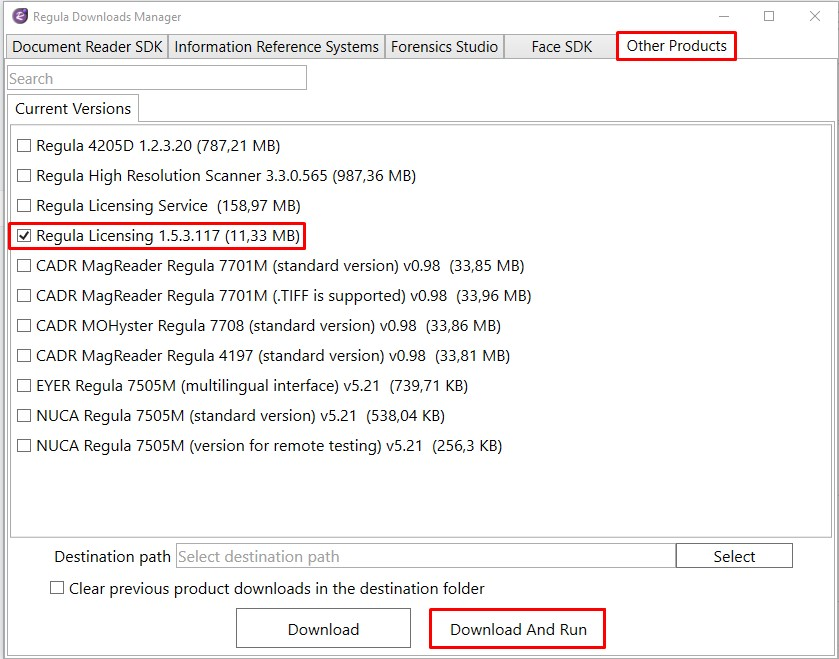

# Windows

## Install Document Reader Web API

The software is available to download using [Regula Downloads Manager](https://support.regulaforensics.com/hc/en-us/articles/115004219343-Regula-Downloads-Manager).


Please note 'Regula Downloads Manager' is only required for the download of the package and has no further impact on Regula Document Reader Web API operation



Document Reader Web API is supported on`(x86) and (x64)`architectures.


1. Select the Document Reader Web API checkbox and click the "Download And Run" button.
2. Follow the Installation Wizard instructions. The Installation Wizard will set up all required prerequisites, register, and automatically start the service.

## **Download Regula Licensing**

Regula Licensing is a utility for the License key management and monitoring. The tool is available for download using [Regula Downloads Manager](https://support.regulaforensics.com/hc/en-us/articles/115004219343-Regula-Downloads-Manager).

Please check the tab ‘**Other Products**’ and download **Regula Licensing** as shown below:



## Obtain and Set up the license key 

For the on-prem operation of Regula Document Reader Web API, a license key is required.

To obtain the license key, please follow the steps below: 

* Launch **Regula Licensing** application
* Click “_Save System Info_”


* **.sysinfo file** will be automatically generated. Please send it to your Sales Manager for further actions or use ‘Send System Info’ to send the request directly to our Support Team specifying your contact details. Some comments on the use-case/project will be much appreciated.




*   Once you receive the license key, there are two ways how the license key can be implemented:  **using the Regula Licensing application or Manually.**

## Set up the license

To access all the capabilities of Regula Document Reader Web API, a license is required.

To obtaining the production license or other purchasing information, please [**submit an inquiry**](https://pipedrivewebforms.com/form/49108714c4cf48cd1001d1b8742b84621841159) and our sales team will contact you shortly.

### Set up license manually

1. Copy the obtained _regula.license_ file to the specific folder with path:



```text
%PROGRAMFILES%\Regula\Document Reader Web API\extBin\win_x64
```



```text
%PROGRAMFILES(x86)%\Regula\Document Reader Web API\extBin\win_x86
```



2. Restart Document Reader Web API service


### Set up license **using Regula Licensing application**


Regula Licensing app is available for download via [Regula Downloads Manager](https://support.regulaforensics.com/hc/en-us/articles/115004219343-Regula-Downloads-Manager) at the "Other Products" Tab


1. Launch the Regula Licensing application.
2. Click the “Install license” button and select the license file _regula.license_ or drag and drop the license file into the application window.


3.
Please make sure the License Key is installed correctly and the License Key information is displayed as follows:


4. Restart Document Reader Web API service


